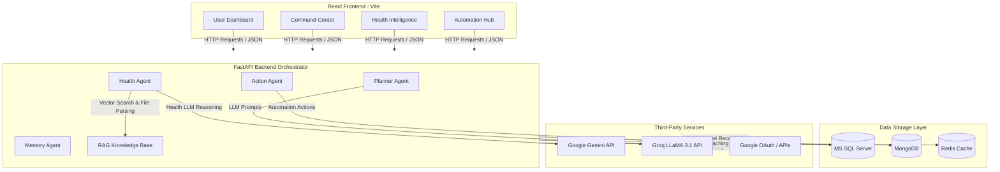

# 🧠 Artificial Personal Digital Twin AI System

An advanced, multi-agent artificial personal digital twin designed to track, analyze, and automate personal workflows, health intelligence, and data management. It coordinates multiple specialized AI agents under an intelligent planning orchestrator to provide tailored biometrics feedback, RAG-based medical document insight extraction, external task automation, and persistent conversational memory.

---

## 🏗️ System Architecture

The Artificial Personal Digital Twin system uses a decoupled client-server architecture consisting of a **React + Vite Frontend** dashboard and a **FastAPI Backend Orchestrator**, backed by a multi-layered database setup (SQL Server, MongoDB, and Redis).

### Architecture Overview Diagram



### Component Details

#### 1. Frontend: React + Vite Dashboard
Located in [/DigitalTwin.Client](file:///c:/Users/User/OneDrive/Desktop/4th%20year/Semester%208/mini%20Project/agentic%20project/Artificial-Personal-Digital-Twin/DigitalTwin.Client), the frontend is built using standard React and Tailwind CSS. It is structured into several key views:
*   **Dashboard** ([Dashboard.jsx](file:///c:/Users/User/OneDrive/Desktop/4th%20year/Semester%208/mini%20Project/agentic%20project/Artificial-Personal-Digital-Twin/DigitalTwin.Client/src/pages/Dashboard.jsx)): A comprehensive analytics screen showing active agents, status checks, memory capacity, database health flags, and overall biometric parameters.
*   **Command Center** ([CommandCenter.jsx](file:///c:/Users/User/OneDrive/Desktop/4th%20year/Semester%208/mini%20Project/agentic%20project/Artificial-Personal-Digital-Twin/DigitalTwin.Client/src/pages/CommandCenter.jsx)): A command interface to send queries directly to the Planner/Orchestrator, visualizing step-by-step task processing.
*   **Health Intelligence** ([HealthIntelligence.jsx](file:///c:/Users/User/OneDrive/Desktop/4th%20year/Semester%208/mini%20Project/agentic%20project/Artificial-Personal-Digital-Twin/DigitalTwin.Client/src/pages/HealthIntelligence.jsx)): Handles medical file uploads (PDF extraction), biometrics logging, trends visualization via responsive charts, and displays recommendations generated by the Health Agent.
*   **Automation Hub** ([AutomationHub.jsx](file:///c:/Users/User/OneDrive/Desktop/4th%20year/Semester%208/mini%20Project/agentic%20project/Artificial-Personal-Digital-Twin/DigitalTwin.Client/src/pages/AutomationHub.jsx)): Manage automations, execution workflows, external triggers, and tasks history.
*   **Authentication** ([Login.jsx](file:///c:/Users/User/OneDrive/Desktop/4th%20year/Semester%208/mini%20Project/agentic%20project/Artificial-Personal-Digital-Twin/DigitalTwin.Client/src/pages/Login.jsx) & [Register.jsx](file:///c:/Users/User/OneDrive/Desktop/4th%20year/Semester%208/mini%20Project/agentic%20project/Artificial-Personal-Digital-Twin/DigitalTwin.Client/src/pages/Register.jsx)): Secure credential handling with JWT session storage.

#### 2. Backend: FastAPI Agentic Orchestrator
Located in [/DigitalTwin.API](file:///c:/Users/User/OneDrive/Desktop/4th%20year/Semester%208/mini%20Project/agentic%20project/Artificial-Personal-Digital-Twin/DigitalTwin.API), the Python backend leverages specialized agent modules:
*   **Planner Agent** ([/DigitalTwin.API/agents/planner](file:///c:/Users/User/OneDrive/Desktop/4th%20year/Semester%208/mini%20Project/agentic%20project/Artificial-Personal-Digital-Twin/DigitalTwin.API/agents/planner)): Parses natural language prompts using Groq (LLaMA 3.1) and outputs a structured execution plan graph with dependent, sequential, or parallel tasks.
*   **Health Agent** ([health_agent.py](file:///c:/Users/User/OneDrive/Desktop/4th%20year/Semester%208/mini%20Project/agentic%20project/Artificial-Personal-Digital-Twin/DigitalTwin.API/api/v1/endpoints/health/health_agent.py)): Connects to a RAG database containing uploaded medical PDFs, answers user questions using Gemini API models, and evaluates daily biometric data points.
*   **Memory Agent** ([memory.py](file:///c:/Users/User/OneDrive/Desktop/4th%20year/Semester%208/mini%20Project/agentic%20project/Artificial-Personal-Digital-Twin/DigitalTwin.API/api/v1/endpoints/memory.py)): Manages user preferences, chat logs, and digital memory persistence.
*   **Action Agent** ([action.py](file:///c:/Users/User/OneDrive/Desktop/4th%20year/Semester%208/mini%20Project/agentic%20project/Artificial-Personal-Twin/DigitalTwin.API/api/v1/endpoints/action.py)): Executes external system workflows, such as retrieving OAuth code, syncing calendar schedules, and triggering automation parameters.

#### 3. Databases and Caches
*   **MS SQL Server**: Handles user data, profiles, and transactional data schemas.
*   **MongoDB**: Hosts unstructured data logs (e.g., medical files analysis, document extractions, and memory stores).
*   **Redis**: High-speed cache for session management and quick task state checks.

---

## ⚙️ Environment Configuration

> [!IMPORTANT]
> To run this project successfully, you **must create two `.env` files** containing the exact same values and fields:
> 1.   **Root Directory `.env`**: [/.env](file:///c:/Users/User/OneDrive/Desktop/4th%20year/Semester%208/mini%20Project/agentic%20project/Artificial-Personal-Digital-Twin/.env) (Loaded by Docker Compose services)
> 2.   **Backend Directory `.env`**: [/DigitalTwin.API/.env](file:///c:/Users/User/OneDrive/Desktop/4th%20year/Semester%208/mini%20Project/agentic%20project/Artificial-Personal-Digital-Twin/DigitalTwin.API/.env) (Loaded by backend local runs and service test suites)

### Required Environment Fields

Below is the list of fields required in both `.env` files:

| Variable Name | Description | Recommended/Default Value |
| :--- | :--- | :--- |
| `MONGO_URI` | MongoDB Connection String (Atlas URI or Local Server) | `mongodb+srv://<username>:<password>@cluster.mongodb.net/digital_twin_db` |
| `DB_HOST` | Host address of SQL Server instance | `sqlserver` (for Docker) or `localhost` (for local setup) |
| `DB_PORT` | Port number of the SQL Server database | `1433` |
| `DB_NAME` | Database schema name | `DigitalTwin` |
| `DB_AUTH` | SQL Server Authentication Type | `sql` |
| `DB_USER` | SQL Server Username | `sa` |
| `DB_PASSWORD` | SQL Server Authentication Password | *Choose a strong password* |
| `REDIS_HOST` | Redis Server Hostname | `redis` (for Docker) or `localhost` (for local setup) |
| `REDIS_PORT` | Redis Server Port | `6379` |
| `REDIS_DB` | Redis DB Index | `0` |
| `SECRET_KEY` | Secret key used to sign JWT session tokens | *Secure randomly-generated string* |
| `ALGORITHM` | Algorithm used for token validation | `HS256` |
| `ACCESS_TOKEN_EXPIRE_MINUTES` | JWT token validity timeframe in minutes | `30` |
| `GEMINI_API_KEY` | Google Gemini API key for the Health Agent | `AIzaSy...` |
| `GROQ_API_KEY` | Groq Developer API key for the Planner Agent | `gsk_...` |
| `GOOGLE_CLIENT_ID` | Client ID for Google Integration Services | *Your Google OAuth Client ID* |
| `GOOGLE_CLIENT_SECRET` | Client Secret for Google Integration Services | *Your Google OAuth Secret* |
| `GOOGLE_REDIRECT_URI` | Authorized callback endpoint for Google OAuth | `http://127.0.0.1:8000/action/google/callback` |

### Environment File Template (`.env`)

You can use the following template to set up both environment files:

```properties
# MongoDB URI
MONGO_URI=mongodb+srv://<username>:<password>@cluster.mongodb.net/digital_twin_db

# MS SQL Server Configuration
DB_HOST=sqlserver
DB_PORT=1433
DB_NAME=DigitalTwin
DB_AUTH=sql
DB_USER=sa
DB_PASSWORD=StrongPass123!

# Redis Cache Configuration
REDIS_HOST=redis
REDIS_PORT=6379
REDIS_DB=0

# JWT Auth Settings
SECRET_KEY=your_secret_key_here
ALGORITHM=HS256
ACCESS_TOKEN_EXPIRE_MINUTES=30

# AI Models Keys
GEMINI_API_KEY=AIzaSy...
GROQ_API_KEY=gsk_...

# Google OAuth Configuration
GOOGLE_CLIENT_ID=your_google_client_id.apps.googleusercontent.com
GOOGLE_CLIENT_SECRET=your_google_client_secret
GOOGLE_REDIRECT_URI=http://127.0.0.1:8000/action/google/callback
```

---

## 🚀 How to Run

### Method A: Running via Docker (Recommended)

Running the application via Docker Compose builds the backend and frontend services, sets up isolated Redis and SQL Server database containers, and handles database initialization automatically.

#### 1. SQL Server Authentication configuration (Required for Host Database connections)
If you are planning to connect to a SQL Server database running directly on your Windows host instead of inside Docker:
1. Open **SQL Server Management Studio (SSMS)**.
2. Right-click the server instance name -> click **Properties** -> click **Security** -> select **SQL Server and Windows Authentication mode** under *Server authentication*.
3. Expand **Security** -> click **Logins** -> right-click **sa** (or create a new user login) -> click **Properties**. Set a strong password, and in the *Status* page, make sure the login is **Enabled** and permission to connect is **Granted**.
4. Configure SQL Server to allow TCP/IP connections: Open **SQL Server Configuration Manager**, enable **TCP/IP** under *SQL Server Network Configuration -> Protocols*, and set TCP Port under *IP Addresses* to `1433`.
5. Restart the SQL Server Windows service.

#### 2. Run Docker Compose
Open a terminal in the root directory and execute:
```bash
docker compose up --build -d
```
*   `--build` instructs Docker to rebuild the custom Python backend and React frontend container images.
*   `-d` runs the containers in detached (background) mode.

#### 3. Access the Applications
*   **Frontend Web Dashboard**: Open your browser at [http://localhost:8080](http://localhost:8080)
*   **Backend OpenAPI Documentation**: Access [http://localhost:8000/docs](http://localhost:8000/docs)

#### 4. Managing Containers
*   **View Logs**:
    ```bash
    docker compose logs -f
    ```
*   **Stop and Remove Containers**:
    ```bash
    docker compose down
    ```

For detailed network configurations and troubleshooting steps (such as configuring Windows Firewall for port `1433`), check the [README.docker.md](file:///c:/Users/User/OneDrive/Desktop/4th%20year/Semester%208/mini%20Project/agentic%20project/Artificial-Personal-Digital-Twin/README.docker.md) file.

---

### Method B: Running Locally (Development)

To run the client and API servers individually outside Docker containers, follow these steps:

#### Prerequisites
*   Python 3.11 installed.
*   Node.js 18+ and npm installed.
*   Local MongoDB, Redis, and SQL Server instances running and configured matching your `.env` values.

#### 1. Spin up the FastAPI Backend
1.  Navigate to the API folder:
    ```bash
    cd DigitalTwin.API
    ```
2.  Create and activate a Python virtual environment:
    ```bash
    python -m venv venv
    # On Windows:
    .\venv\Scripts\activate
    ```
3.  Install the required dependencies:
    ```bash
    pip install -r requirements.txt
    ```
4.  Run the application server:
    ```bash
    uvicorn main:app --reload --host 127.0.0.1 --port 8000
    ```

#### 2. Spin up the Vite Frontend
1.  Navigate to the client folder in a new terminal window:
    ```bash
    cd DigitalTwin.Client
    ```
2.  Install npm packages:
    ```bash
    npm install
    ```
3.  Start the local development server:
    ```bash
    npm run dev
    ```
4.  Open the local development URL displayed in your console (usually `http://localhost:5173`).
